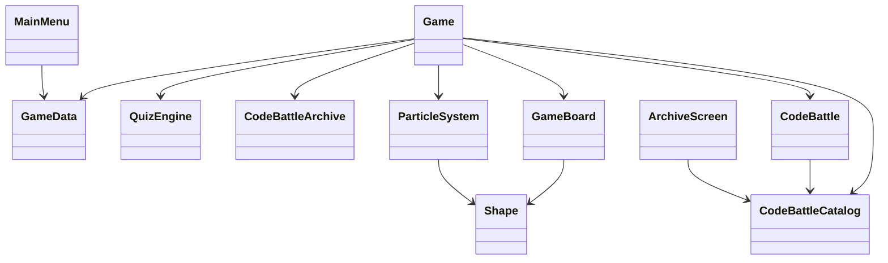

# Python Blaster: Code & Clear


<div align="center">

**Аркадная головоломка с фигурами, викториной по Python и Code-Battle редактором.**  
Минималистичный дизайн, плавные частицы, достижения, JSON-каталоги задач и вопросов, режим **НУБ/ПРО** и окно **Архив**.

[](https://www.python.org/)
[](https://www.pygame.org/)
[](#license)
[](#credits)


</div>

---

## Оглавление

- [Особенности](#особенности)
- [Установка и запуск](#установка-и-запуск)
- [Управление](#управление)
- [Игровые режимы](#игровые-режимы)
- [Структура проекта](#структура-проекта)
- [Данные и форматы JSON](#данные-и-форматы-json)
  - [Вопросы викторины (`data/questions.json`)](#вопросы-викторины-dataquestionsjson)
  - [Каталог задач Code-Battle (`data/code_battles_catalog.json`)](#каталог-задач-code-battle-datacode_battles_catalogjson)
  - [Лог сыгранных баттлов (`data/code_battles.json`)](#лог-сыгранных-баттлов-datacode_battlesjson)
- [Алгоритм сложности и «возможность проиграть»](#алгоритм-сложности-и-возможность-проиграть)
- [Архитектура (Mermaid)](#архитектура-mermaid)
- [FAQ / Траблшутинг](#faq--траблшутинг)
- [Roadmap](#roadmap)
- [Благодарности](#благодарности)
- [Приложение: готовые задачи для каталога](#приложение-готовые-задачи-для-каталога)

---

## Особенности

- 🎯 **Геймплей 8×8**: перетаскивай фигуры, заполняй линии, зарабатывай очки.
- 🧠 **Викторина по Python**: каждые N линий — рандомный вопрос (4 варианта).
- 💻 **Code-Battle (ПРО)**: встраиваемый редактор кода с подсветкой, таймером и автодополнением.  
  ▸ **Шаблоны пустые** — решение игрок пишет сам.  
  ▸ **Верный код и объяснение доступны только в «Архиве»**.
- 🏆 **Достижения и рекорды**: прогресс и статистика сохраняются в JSON.
- 🎛️ **Режим НУБ/ПРО**: мини-кнопка **НУБ/ПРО** справа от «Начать игру».  
  ▸ *НУБ*: только викторина. ▸ *ПРО*: викторина + code-battle.
- 🗂️ **Архив**: окно со **всеми задачами** каталога (код-решения + объяснения). Кнопка — **в правом нижнем углу** главного меню.
- ✨ **Минималистичный UI и частицы**: легкие анимации, притягивание фигур, «ghost»-контуры.

---


## Установка и запуск

```bash
# 1) Клонируй
git clone https://github.com/<your-username>/<your-repo>.git
cd <your-repo>

# 2) Виртуальное окружение (опционально)
python -m venv .venv
# Windows:
.venv\Scripts\activate
# macOS/Linux:
source .venv/bin/activate

# 3) Зависимости
pip install pygame

# 4) Запуск
python main.py
```

> Python 3.9+ рекомендуется.

---

## Управление

- 🎲 **Игровое поле**: **мышь** — перетаскивание фигур.
- 🧩 **События** (после каждой 5-й линии):
  - *НУБ*: вопрос викторины.
  - *ПРО*: 50/50 — викторина или code-battle.
- ❓ **Викторина**: клавиши **1–4** — выбор ответа.
- 💻 **Code-Battle**:
  - **Tab** — отступ (4 пробела)
  - **Ctrl+Enter** — отправить решение
  - **Стрелки/Home/End** — курсор
- ⎋ **ESC** — в главное меню.

---

## Игровые режимы

- **НУБ** — только вопросы, без редактора кода.  
- **ПРО** — вопросы + code-battle.  
Переключение — мини-кнопка **НУБ/ПРО** справа от «Начать игру».

---

## Структура проекта

```
.
├── main.py                          # Вся логика игры (однофайловая сборка)
├── data/
│   ├── questions.json               # Вопросы викторины
│   ├── code_battles_catalog.json    # Каталог задач code-battle + решения/объяснения
│   ├── code_battles.json            # Лог сыгранных баттлов (создаётся автоматически)
│   └── game_data.json               # Статистика/рекорды (создаётся автоматически)
└── docs/
    └── screenshot-*.png             # Скриншоты (необязательно)
```

---

## Данные и форматы JSON

### Вопросы викторины (`data/questions.json`)

- Всегда **ровно 4 варианта**.  
- Поле `correct` — **индекс верного ответа** (0..3).  
- В игре варианты **перемешиваются**, индекс корректируется автоматически.

Пример:

```json
{
  "questions": [
    {
      "question": "Переведите число 255 в шестнадцатеричную систему:",
      "options": ["FF", "FE", "100", "255"],
      "correct": 0,
      "explanation": "255(10) = FF(16) (15*16 + 15)."
    },
    {
      "question": "Что выведет print(len('Python'))?",
      "options": ["6", "5", "7", "Ошибка"],
      "correct": 0,
      "explanation": "Длина строки 'Python' равна 6."
    }
  ]
}
```

### Каталог задач Code-Battle (`data/code_battles_catalog.json`)

- Содержит **все задачи** для режима code-battle и **для окна «Архив»**.
- В игре решение не показывается — используется `template`, `test_cases`, `hints`.
- В Архиве выводятся `solution` и `explanation`.

Пример элемента:

```json
{
  "name": "Палиндром",
  "description": "Проверьте, является ли строка палиндромом (игнорируйте пробелы и регистр)",
  "template": "def is_palindrome(s):\n    # Напишите ваш код здесь\n    pass",
  "test_cases": [
    {"input": ["racecar"], "expected": true},
    {"input": ["hello"], "expected": false},
    {"input": ["A man a plan a canal Panama"], "expected": true},
    {"input": [""], "expected": true}
  ],
  "difficulty": "medium",
  "time_limit": 180,
  "reward": 300,
  "hints": ["Нормализуйте строку", "Сравните с перевёрнутой"],
  "solution": "def is_palindrome(s):\n    s = ''.join(c.lower() for c in s if c.isalnum())\n    return s == s[::-1]",
  "explanation": "Фильтруем не буквенно-цифровые, приводим к нижнему, сравниваем с разворотом."
}
```

> В JSON нет кортежей — `input` задаём списком (`[]`). В коде аргументы распаковываются как `function(*input)`.

### Лог сыгранных баттлов (`data/code_battles.json`)

- Автособирается **после завершения** code-battle.  
- Нужен для аналитики (в Архиве показывается **каталог**, а не лог).

Структура:

```json
{
  "items": [
    {
      "date": "2025-01-01T12:34:56",
      "challenge_name": "Сумма двух чисел",
      "challenge_desc": "Напишите функцию...",
      "code": "def add(a, b): ...",
      "success": true,
      "message": "Все тесты пройдены!",
      "reward": 200,
      "time_spent_sec": 73
    }
  ]
}
```

---

## Алгоритм сложности и «возможность проиграть»

- Фигуры делятся на **простые / средние / сложные**.  
  С ростом `score` уменьшается доля простых (`easy → normal → hard`).
- Оценка хода учитывает **соседство** и **потенциальные линии** — бесконечных «сладких» мест нет.
- **Проигрыш** — когда **ни одну** из трёх фигур **нельзя поставить** (проверяется каждый кадр).

---

## Архитектура (Mermaid)



---

## FAQ / Траблшутинг

**Текст на кнопках не видно** — замени шрифт `consolas` на системный: `pygame.font.SysFont(None, size)`.  
**Pygame не запускается** — `pip install pygame`, проверь Python 3.9+.  
**Вопросы не подхватываются** — проверь JSON и что у каждого вопроса **4 варианта**.  
**Code-Battle показывает ответ** — в игре решения **не выводятся**, смотри **Архив**.

---

## Roadmap

- Онлайн-лидерборд.
- Подбор фигур с учётом «дыр» на поле.
- Дополнительные темы оформления.
- Импорт/экспорт прогресса.

---

---

## Благодарности

Автор и вдохновение: **Tima0707** 💙  
Сообщество Pygame и Python.

---

## Приложение: готовые задачи для каталога

Добавь элементы в массив `items` файла `data/code_battles_catalog.json`.

```json
{
  "name": "Сумма цифр числа",
  "description": "Верните сумму цифр неотрицательного целого n",
  "template": "def digit_sum(n):\n    # Напишите ваш код здесь\n    pass",
  "test_cases": [
    {"input": [0], "expected": 0},
    {"input": [7], "expected": 7},
    {"input": [123], "expected": 6},
    {"input": [9999], "expected": 36}
  ],
  "difficulty": "easy",
  "time_limit": 120,
  "reward": 250,
  "hints": ["Преобразуйте в строку или используйте // и %", "Аккуратно суммируйте"],
  "solution": "def digit_sum(n):\n    s = 0\n    while n > 0:\n        s += n % 10\n        n //= 10\n    return s",
  "explanation": "Классический разбор на цифры через деление на 10; O(d), где d — число цифр."
}
```

```json
{
  "name": "Удалить гласные",
  "description": "Верните строку без гласных (англ. aeiou, регистр игнорируйте)",
  "template": "def remove_vowels(s):\n    # Напишите ваш код здесь\n    pass",
  "test_cases": [
    {"input": ["hello"], "expected": "hll"},
    {"input": ["PYTHON"], "expected": "PYTHN"},
    {"input": ["AEiou"], "expected": ""},
    {"input": ["ChatGPT"], "expected": "ChtGPT"}
  ],
  "difficulty": "medium",
  "time_limit": 150,
  "reward": 300,
  "hints": ["Создайте множество гласных", "Фильтруйте символы циклом/генератором"],
  "solution": "def remove_vowels(s):\n    v = set('aeiouAEIOU')\n    return ''.join(ch for ch in s if ch not in v)",
  "explanation": "Множество даёт O(1) проверку принадлежности; генератор строит новую строку."
}
```

---


